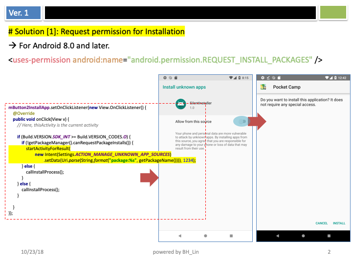
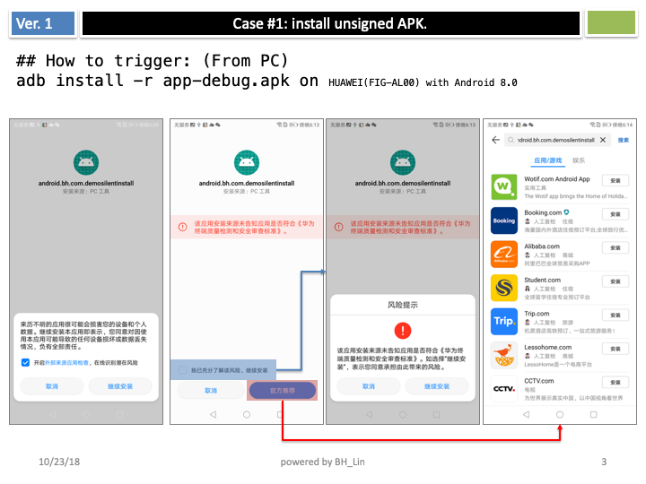
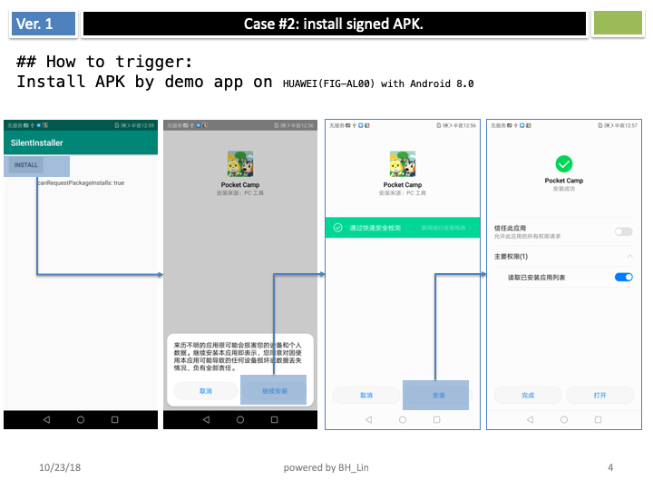
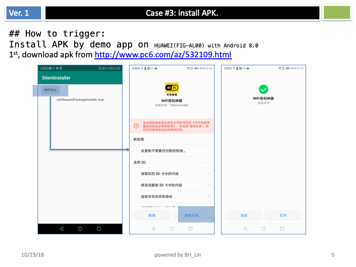
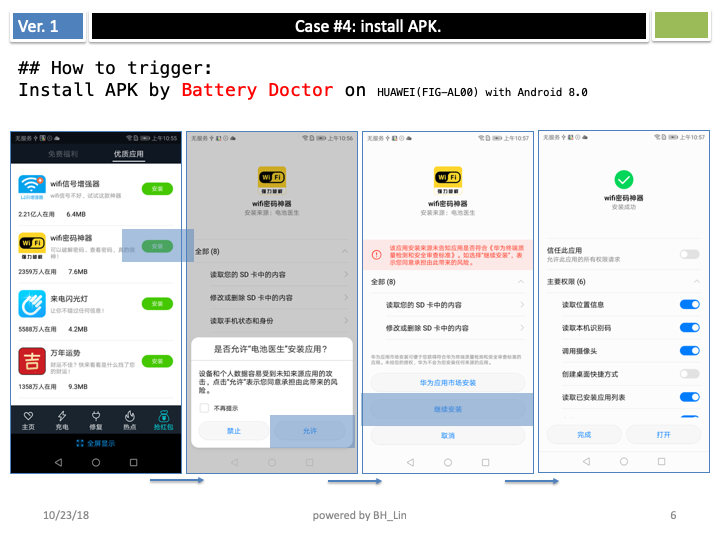

# MyInstaller

Demo Package install on Android 8.0 (Oreo)  

### How to Test.
1. Push Apk into download folder for testing.  
adb push ./resources_for_testing/com.syezon.wifikey.apk /sdcard/Download/  
2. Launch app "MyInstaller" and press button "install"   

